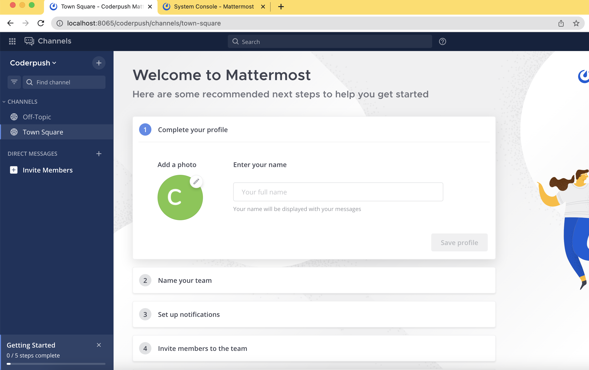
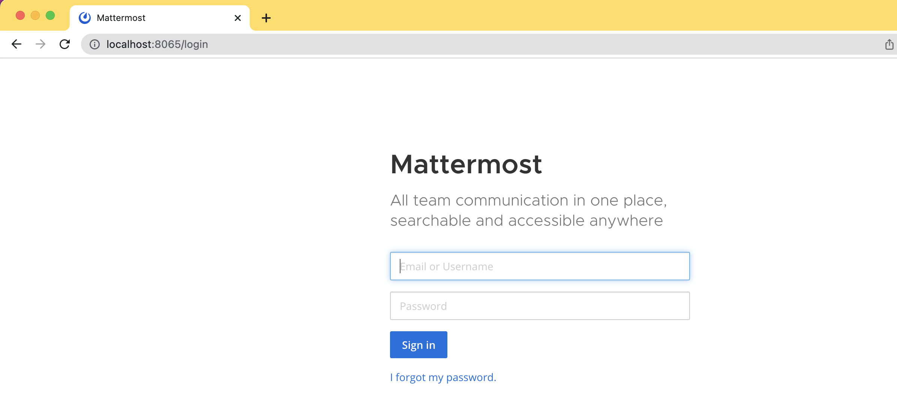
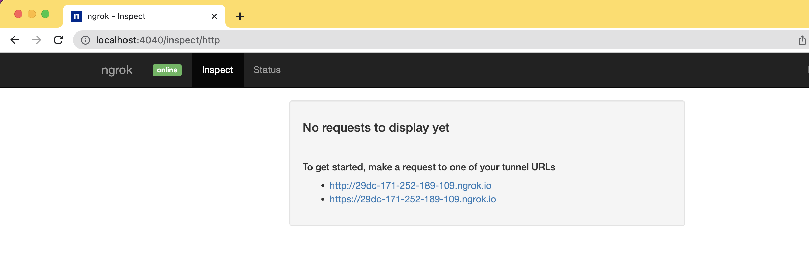
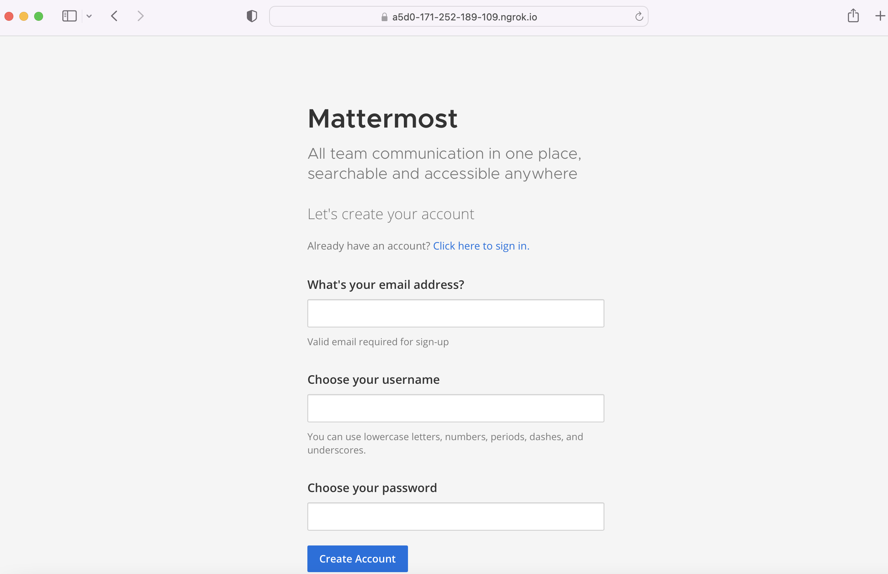
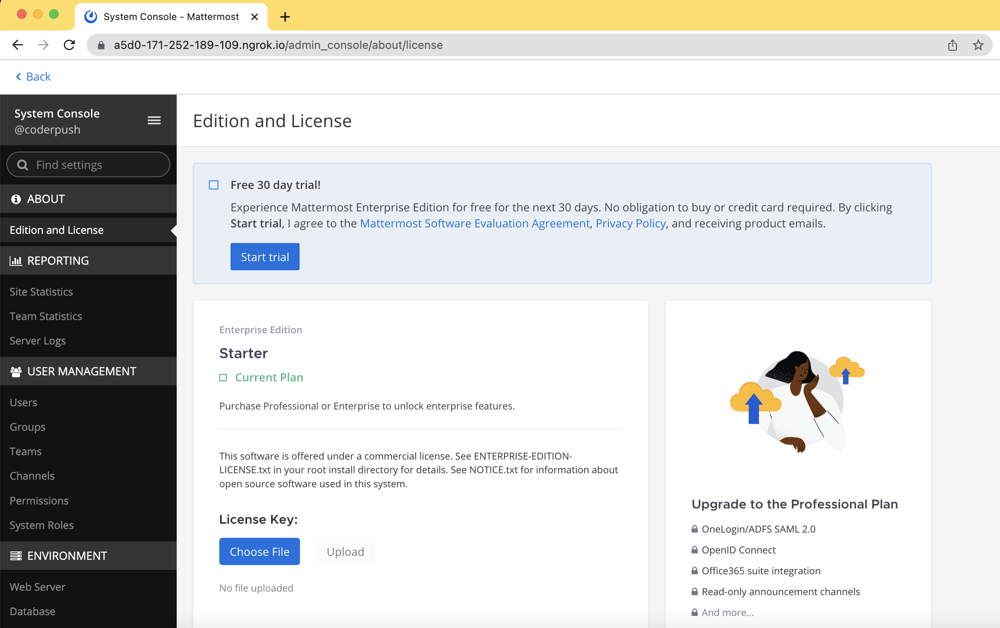

# Introduction
- `Mattermost` is a secure, open source platform for communication, collaboration, and workflow orchestration across tools and teams.

- In addition to the web interface, you can also download Mattermost clients for Android, iOS, Windows PC, macOS, and Linux.

Visit homepage: https://mattermost.com/



# Install Mattermost via Docker
Deploy a Mattermost Self-hosted instance in minutes via Docker

- For production: Use `NGINX` and config TLS (using a pre-existing certificate and key or create a new certificate and key by Letsencrypt)
- For demo: Use `Ngrok` to expose Mattermost on your local machine and it can be reached from Internet 

## Prerequisites
- Install `docker` and `docker-compose` on local machine

## Deploy
1. In a terminal window, clone the repository and enter the directory
    ```
    git clone https://github.com/triethuynh92/docker
    cd docker
2. Create your `.env` file by copying and adjusting the `env.example` file
At a minimum, you must edit the `DOMAIN` value in the `.env` file to correspond to the domain for your Mattermost server.
3. Create the required directories
    ```
    mkdir -p ./volumes/app/mattermost/{config,data,logs,plugins,client/plugins,bleve-indexes}
4. Deploy Mattermost without using the included NGINX
    ```
    docker-compose -f docker-compose.yml -f docker-compose.without-nginx.yml up -d

- To access your new Mattermost deployment on local machine, navigate to `http://localhost:8065`

- To get URL access from Internet, navigate to `http://localhost:4040/inspect/http`


- To access `Admin Console Page`, navigate to `http://localhost:8065/admin_console/` or `https://xxx.ngrok.io/admin_console/`


- To shut down your deployment 
    ```
    docker-compose -f docker-compose.yml -f docker-compose.without-nginx.yml down
